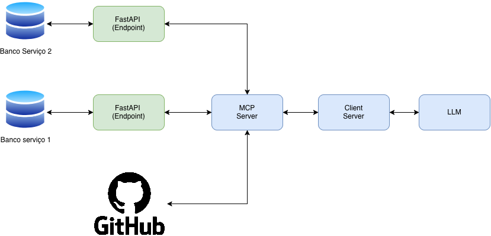

# Workshop-ML-LLM-Server
Repositório para simular um servidor MCP e banco de dados para o workshop de dados e ML.

Os serviços aqui são:
- Fastapi + Postgres
- MCP Server

# Quick starter
Para iniciar o projeto basta usar o docker compose na raíz do projeto.

```bash
$ docker compose up -d
```

# Esquemático da arquitetura
Para acessar o "Client Server" acesse o [respositório](https://github.com/Migliorin/Workshop-ML-LLM) e acesse "notebooks". Lá contém os notebooks usados para ministrar o workshop.


